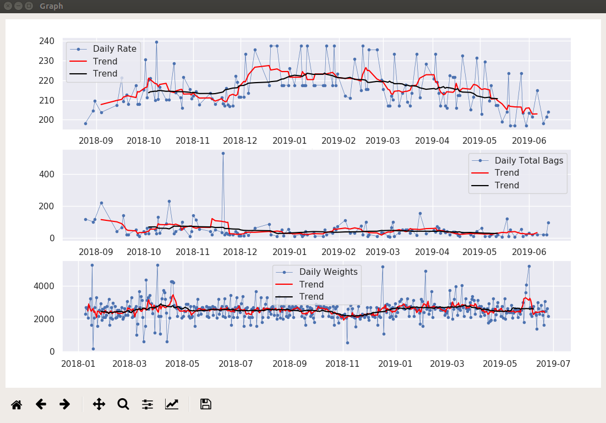

## Description
This project contains a sample graphical user interface made using pyqt 5.9.2 for data visualization and Time series data prediction. The data is extracted from Excel format in Sales data.xls and Production data.xls and used for Data visualization. The count Wise sales is used for time series prediction using arima.

---

## Required Dependencies
  Install [Anaconda](https://www.anaconda.com/distribution/) for pyqt version 5.9.2  
### Following Python libraries required
 - matplotlib
 - pandas
 - scipy
 - seaborn
 - numpy
 - datetime
 - pyramid-arima
---

## Initial Setup

``` 
source activate root
sudo bash setup.bash 
```

---
 ## Running

 ```
 source activate root
 python3 gui.py
 ```
---

## Images





